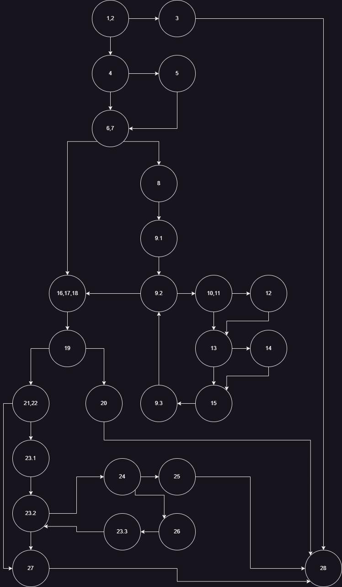
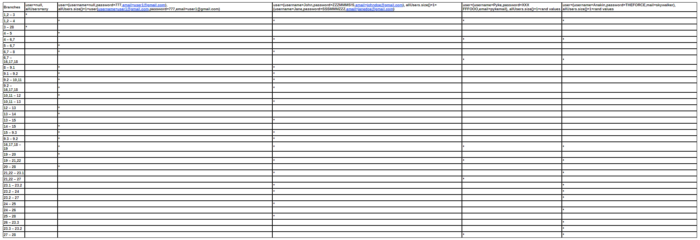

# Todor Mitevski 213165
# 2. CFG за функцијата

# 3. Цикломатска комплексност
Цикломатска комплексност: 11 
Цикломатската комплексност се пресметува со броење на предикатни јазли 
p + 1 каде што p е број на предикатни јазли. 
Исто така се пресметува со боење на уникатни региони. 
Предикатни јазли во графот: 10 => 10 + 1 = 11 
Уникатни региони во графот: 11

# 4. Every Branch критериум

1. user=null, allUsers=anything 
2. user=(username=null,password=777,email=user1@gmail.com), allUsers.size()=1=user(username=user1@gmail.com,password=777,email=user1@gmail.com) 
3. user=(username=John,password=ZZZMMMS!S,email=johndoe@gmail.com), allUsers.size()=1=(username=Jane,password=SSSMMMZZZ,email=janedoe@gmail.com) 
4. user=(username=Pyke,password=XXX FFFOOO,email=pykemail), allUsers.size()=1=rand values != user values 
5. user=(username=Anakin,password=THEFORCE,mail=skywalker), allUsers.size()=1=rand values != user values 
Every Branch критериумот е исполнет со горенаведените пет теста.

# 5. Multiple Condition критериум
### if (user==null || user.getPassword()==null || user.getEmail()==null)
1. T || X || X -> user = null, user.getPassword() = anything, user.getEmail() = anything
2. F || F || T -> user = non-null, user.getPassword() = non-null, user.getEmail() = null
3. F || T || X -> user = non-null, user.getPassword() = null, user.getEmail() = anything
4. F || F || F -> user = non-null, user.getPassword() = non-null, user.getEmail() = non-null